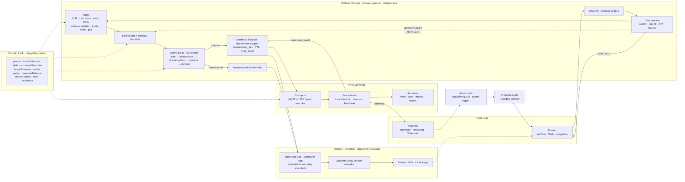

# Embodied Agent

[中文](README.md) | **English**

> An Agent Runtime for the physical world — not an IoT dashboard or an LLM that directly drives devices.

Development and PRs belong on the private repo `topkyo/embodied-agent-internal`. `topkyo/embodied-agent` is a read-only public snapshot. See [`docs/operations/repos.zh.md`](docs/operations/repos.zh.md).

Embodied Agent bridges natural language to physical action with a deterministic, auditable safety chain. Opening a valve, moving a robot, starting a fan — these actions have no undo.

The LLM only interprets language. It does not authorize actions, select devices, publish MQTT/GPIO commands, or decide whether an action succeeded. The Platform Runtime owns identity, schemas, safety, confirmation, command lifecycle, and outcome verification; the Scene Node owns on-site execution, local timeouts, and interlocks.

## How it works

```
Natural language → LLM intent (structured JSON) → Schema validation → Skill routing
  → Safety judge (fail-closed) → Physical command → Scene Node → Telemetry feedback
  → Outcome evaluation → Auditable evidence
```

The LLM only produces structured intent. Everything downstream — routing, safety, dispatch, evidence — is deterministic code. The safety chain is fail-closed: if any check is missing or inconclusive, the system refuses to act.

This repository currently proves the Runtime and simulator/stub execution paths. The ESP32 reference firmware defaults to `DRY_RUN_GPIO=1`; real hardware loops require deployment-specific acceptance and cannot be inferred from software readiness or simulator evidence.

## Architecture



Three data flows share one deterministic kernel:

| Flow                   | Direction                 | Path                                                                                |
| ---------------------- | ------------------------- | ----------------------------------------------------------------------------------- |
| Conversational control | Human → Machine → Human   | Message → pipeline → LLM intent → routing → safety → command → device → NLG reply   |
| Proactive scene        | Machine → Human → Machine | Telemetry/event → pack scene trigger → push + confirm → same safety chain → outcome |
| Delivery governance    | Offline → Runtime         | Eval corpus → sim-matrix / flywheel → signed evidence → readiness gate              |

## Quick start

**Prerequisites:**

- Node ≥ 20
- `ripgrep` (`rg`)
- `tmux` (or use `npm run dev:greenhouse -- --no-monitor` for backend-only)
- First `npx` invocation may download `aedes-cli`

```bash
npm ci

# Start the greenhouse profile (aedes + API + Web + simulator)
npm run dev:greenhouse

# Or start just the backend services
npm run dev:greenhouse -- --no-monitor

# Check running services
npm run dev:status
```

Intent understanding requires a real LLM — there is no mock or regex fallback, so set `LLM_API_KEY` in `.env` first (copy from `.env.example`). Without it the chat path returns 503 by design.

Send a message through the dev chat endpoint and watch it enter the simulated command lifecycle:

```bash
curl -X POST http://127.0.0.1:3001/dev/chat \
  -H 'content-type: application/json' \
  -d '{"text":"打开一号棚风机","user_id":"dev-user","conversation_id":"dev-1"}'
```

The runtime parses intent, validates it against the pack schema, runs the safety judge, and dispatches a command to the simulated Scene Node. The workbench at `http://127.0.0.1:5173` is for install and review — device state, run status, and the evidence trail. It has no chat box; operators talk to the agent through WeChat or an integration channel.

Other profiles:

```bash
npm run dev:robot        # Robotics / M20
npm run dev:industrial   # Industrial / overheat ventilation
```

## Core concepts

| Concept              | Definition                                                                                                                                                                        |
| -------------------- | --------------------------------------------------------------------------------------------------------------------------------------------------------------------------------- |
| **Platform Runtime** | The domain-agnostic kernel: channels, LLM intent, routing, safety, node runtime, memory, deployment. Lives in `packages/` and `apps/api/`.                                        |
| **Domain Pack**      | A contract that binds the Runtime to a physical domain: skills, schemas, target resolution, safety, transport, outcomes, and readiness. Lives in `scenes/{pack}/`.                |
| **Scene Node**       | The on-site execution contract: node identity, config application, command accept/reject, and event reporting. Implemented by a simulator, reference firmware, or device adapter. |
| **Deployment**       | A runtime instance identified by `deployment_id`; it may be a simulator, bench rig, or real site. Each instance runs exactly one `active_domain`.                                 |
| **Evidence**         | The auditable trail: `intent-resolve.jsonl` → `operation-logs.jsonl` → `command-logs.jsonl` (before/after telemetry) → `scene-outcomes.jsonl`.                                    |

## Write your own Domain Pack

```bash
npm run domain:new -- --id my-domain --slug my-domain --transport mqtt
```

This scaffolds `scenes/my-domain/` and registers the pack in `domain-packs.json`:

```text
manifest.ts                     pack identity, display name, transport
skills.ts                       p0 / p1 / physical skill IDs
schemas/intent.ts               Zod intent schemas
prompt/scene-skills.ts          prompt section + intent contract
scene/pack.ts                   createDomainPackContract() assembly
scene/registry.ts               device registry seed
scene/target-resolver.ts        intent target → device ID
structural/structural-intent.ts deterministic intent overrides
```

The eval corpora are not scaffolded — you add them and point `core.eval` at them.

A contract is `{ core, capabilities }` (`packages/core/src/domain-pack-contract-aggregate.ts`).

`core` requires:

| Field                 | Purpose                                               |
| --------------------- | ----------------------------------------------------- |
| `manifest`            | Pack identity, display name, web slug                 |
| `skills`              | `p0` / `p1` / `physical` skill IDs                    |
| `intentSchemas`       | Zod schemas for the structured intent the LLM outputs |
| `prompt`              | System prompt section + intent contract text          |
| `eval`                | Paths to the eval corpora                             |
| `structuralOverrides` | Deterministic intent overrides (bypass the LLM)       |
| `targetResolver`      | Resolve intent targets to physical device IDs         |
| `sceneRuntime`        | Proactive scene triggers and outcome evaluation       |
| `context`             | Pack runtime context                                  |

`core` optionally accepts `safety` (authorization + duration threshold), `commandAdapter` (`commandBuilder` / `physicalExecutor` / `commandReplies`), and `readiness` (required transports + probes).

`capabilities` is a list of named extension points — `scene`, `nlg`, `ops`, `evidence`, `skill-handler`, `proactive-alerts`, `scheduled-reports`, and others declared in the same file.

See [`docs/domain-pack/authoring.zh.md`](docs/domain-pack/authoring.zh.md) for the skill authoring guide and [`docs/domain-pack/delivery-kit.zh.md`](docs/domain-pack/delivery-kit.zh.md) for the minimum delivery checklist.

## Domain Packs and validation status

| Pack        | Scene                | Runtime status | Execution evidence                                       | Location              |
| ----------- | -------------------- | -------------- | -------------------------------------------------------- | --------------------- |
| agriculture | Greenhouse           | Loadable       | Dual-simulator verified; real actuator loop pending      | `scenes/greenhouse/`  |
| robotics    | M20 robot            | Loadable       | M20 stub verified; real M20 evidence not in repository   | `scenes/robot/`       |
| industrial  | Overheat ventilation | Loadable       | In-memory Modbus/simulated exhaust; real cabinet pending | `scenes/industrial/`  |
| aquaculture | —                    | Placeholder    | No execution validation                                  | `scenes/aquaculture/` |

`status: live` in the catalog means that a pack can be activated by the Runtime and participate in software gates; it does not mean that real-site hardware has passed acceptance. The three loadable packs are reference implementations of the Runtime contract, not three finished products; placeholders do not provide equivalent capabilities. Domain-specific docs live in `scenes/{pack}/docs/`.

## Security model

The safety chain is **fail-closed** — missing config, inconclusive checks, or unknown device states cause visible refusals, not silent fallbacks.

1. **Role check** — principal must have permission for the requested action
2. **Device state check** — device must be in a state that allows the command
3. **Domain policy** — Domain Pack safety rules (e.g., temperature thresholds)
4. **Interlock** — physical interlock conditions must be satisfied
5. **Duration confirmation** — long-running commands require explicit confirmation

Node tokens are AES-256-GCM encrypted at rest. Production deployments must explicitly configure `deployment_id` and `active_domain`. See [`docs/operations/safety-checklist.zh.md`](docs/operations/safety-checklist.zh.md).

## Software and simulator gates

```bash
# Deterministic (no LLM key needed)
npm run lint
npm run test --workspaces --if-present
npm run build

# LLM-dependent (requires LLM_API_KEY)
npm run sim:matrix          # Intent accuracy: 90% / 100% / 100%
npm run domain:flywheel     # Pack scene flow with signed attestation (simulator/stub allowed)
npm run robot:matrix        # Robotics intent matrix
npm run verify:chat         # Chat verification
```

sim-matrix evidence is HMAC-signed with `EVAL_EVIDENCE_SECRET`. The readiness gate uses dual validation: static contract checks (`readiness-pack`) + runtime probes (`readiness-deployment`).

These gates validate software contracts, intent handling, and simulated execution. They are not real-actuator acceptance, field-interlock validation, or safety certification. Physical acceptance must separately record the device, firmware configuration, before/after telemetry, and human sign-off.

## Protocol and ecosystem boundaries

| Interface / protocol | Position in the Runtime                                                           | Current status       |
| -------------------- | --------------------------------------------------------------------------------- | -------------------- |
| MQTT                 | Southbound transport for command, config, event, telemetry, and heartbeat         | Implemented          |
| M20 HTTP             | Robotics direct executor; still passes through safety and command lifecycle       | Stub-validated       |
| Modbus               | Industrial adapter that normalizes field data; writes must not bypass safety      | In-memory simulation |
| MCP                  | Future northbound adapter exposing governed capabilities to external agents       | Not implemented      |
| ROS 2                | Future robotics transport/executor adapter                                        | Not implemented      |
| SINT-like governance | Optional authorization/audit layer; not the deterministic kernel or a Domain Pack | Not implemented      |

## Documentation

| Category     | Index                                                                                        |
| ------------ | -------------------------------------------------------------------------------------------- |
| Architecture | [`docs/architecture/`](docs/architecture/)                                                   |
| Protocol     | [`docs/protocol/`](docs/protocol/)                                                           |
| Domain Pack  | [`docs/domain-pack/`](docs/domain-pack/)                                                     |
| Operations   | [`docs/operations/`](docs/operations/) (repos: [`repos.zh.md`](docs/operations/repos.zh.md)) |
| Integrations | [`docs/integrations/`](docs/integrations/)                                                   |
| Eval         | [`docs/eval/`](docs/eval/)                                                                   |
| Archive      | [CHANGELOG.md](CHANGELOG.md)                                           |

Full reading map: [`docs/README.zh.md`](docs/README.zh.md) (Chinese). Engineering conventions: [`AGENTS.md`](AGENTS.md).

## License

[MIT](LICENSE)
