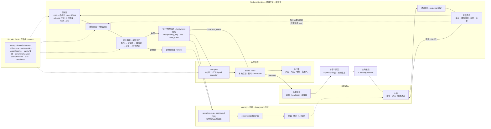

# 具身 Agent / Embodied Agent

**中文** | [English](README.en.md)

> 面向物理世界的 Agent Runtime — 不是 IoT 看板，也不是让 LLM 直控设备的聊天机器人。

开发与 PR 在私仓 `topkyo/embodied-agent-internal`；`topkyo/embodied-agent` 是只读展示快照。分工见 [`docs/operations/repos.zh.md`](docs/operations/repos.zh.md)。

具身 Agent 用确定性、可审计的安全链把自然语言接到物理动作。开阀、移动机器人、启动风机——这些动作没有 undo。

LLM 只负责理解人话；它不授权、不选择设备、不直接发送 MQTT/GPIO，也不判断动作是否成功。Platform Runtime 负责身份、schema、安全、确认、指令生命周期与结果验证；Scene Node 负责现场执行、本地超时和互锁。

## 工作原理

```
自然语言 → LLM 意图（结构化 JSON）→ Schema 校验 → 技能路由
  → 安全裁判（失败关闭）→ 物理指令 → Scene Node → 遥测回流
  → Outcome 评估 → 可审计证据
```

LLM 只输出结构化意图。下游一切——路由、安全、调度、证据——都是确定性代码。安全链失败关闭：任何检查缺失或不确定时，系统拒绝执行，不静默降级。

当前仓库主要证明 Runtime 与模拟 / stub 执行链。ESP32 参考固件默认 `DRY_RUN_GPIO=1`；真实硬件闭环须按具体 deployment 单独验收，不能由软件 readiness 或模拟器证据替代。

## 架构



三条数据流共用一个确定性内核：

| 数据流     | 方向        | 路径                                                             |
| ---------- | ----------- | ---------------------------------------------------------------- |
| 对话控制流 | 人→机→人    | 人话 → 管线 → LLM 意图 → 路由 → 安全 → 指令 → 设备 → 口语回复    |
| 主动场景流 | 机→人→机    | 遥测/事件 → pack 场景触发 → 推送 + 确认 → 同一条安全链 → outcome |
| 交付治理流 | 离线→运行时 | eval 语料 → sim-matrix / flywheel → 签名证据 → readiness 门禁    |

## 快速开始

**前置依赖：**

- Node ≥ 20
- `ripgrep`（`rg`）
- `tmux`（或改用 `npm run dev:greenhouse -- --no-monitor` 只启后台）
- 首次 `npx` 可能下载 `aedes-cli`

```bash
npm ci

# 启动 greenhouse profile（aedes + API + Web + 模拟器）
npm run dev:greenhouse

# 只启动后台基础服务
npm run dev:greenhouse -- --no-monitor

# 查看运行状态
npm run dev:status
```

意图理解只用真实 LLM，没有 mock 也没有正则兜底，所以先在 `.env` 配好 `LLM_API_KEY`（从 `.env.example` 复制）。缺 Key 时对话链路按设计返回 503。

用 dev chat 端点发一句话，看它进入模拟指令生命周期：

```bash
curl -X POST http://127.0.0.1:3001/dev/chat \
  -H 'content-type: application/json' \
  -d '{"text":"打开一号棚风机","user_id":"dev-user","conversation_id":"dev-1"}'
```

运行时会解析意图、按 pack schema 校验、过安全裁判，再向模拟 Scene Node 下发指令。工作台 `http://127.0.0.1:5173` 负责安装与复盘——设备状态、运行状态、证据链，**没有聊天框**；棚主通过微信或集成通道与 Agent 对话。

其他场景 profile：

```bash
npm run dev:robot        # 机器人 / M20
npm run dev:industrial   # 工业 / 过温排风
```

## 核心概念

| 概念                 | 定义                                                                                                                           |
| -------------------- | ------------------------------------------------------------------------------------------------------------------------------ |
| **Platform Runtime** | 领域无关内核：通道、LLM 意图、路由、安全、Node 运行时、Memory、Deployment。在 `packages/` 和 `apps/api/`。                     |
| **Domain Pack**      | 将 Runtime 绑定到具体物理领域的契约：技能、schema、目标解析、安全策略、transport、outcome 与 readiness。在 `scenes/{pack}/`。  |
| **Scene Node**       | 现场执行端契约：持有节点身份、应用配置、执行或拒绝命令并回报事件；可由模拟器、参考固件或设备适配器实现。                       |
| **Deployment**       | 由 `deployment_id` 标识的运行实例，可对应模拟器、台架或真实现场；每个实例只启用一个 `active_domain`。                          |
| **Evidence**         | 可审计证据链：`intent-resolve.jsonl` → `operation-logs.jsonl` → `command-logs.jsonl`（动作前后遥测）→ `scene-outcomes.jsonl`。 |

## 编写自己的 Domain Pack

```bash
npm run domain:new -- --id my-domain --slug my-domain --transport mqtt
```

脚手架生成 `scenes/my-domain/` 并把 pack 登记到 `domain-packs.json`：

```text
manifest.ts                     pack 标识、显示名、transport
skills.ts                       p0 / p1 / physical 技能 ID
schemas/intent.ts               Zod intent schema
prompt/scene-skills.ts          prompt section + intent contract
scene/pack.ts                   createDomainPackContract() 组装
scene/registry.ts               设备注册表种子
scene/target-resolver.ts        意图目标 → 设备 ID
structural/structural-intent.ts 结构性 intent override
```

eval 语料不在脚手架内——需自行准备并由 `core.eval` 指向。

contract 形状为 `{ core, capabilities }`（`packages/core/src/domain-pack-contract-aggregate.ts`）。

`core` 必填：

| 字段                  | 作用                                       |
| --------------------- | ------------------------------------------ |
| `manifest`            | pack 标识、显示名、web slug                |
| `skills`              | `p0` / `p1` / `physical` 技能 ID           |
| `intentSchemas`       | LLM 输出结构化意图的 Zod schema            |
| `prompt`              | 系统 prompt section + intent contract 文本 |
| `eval`                | eval 语料路径                              |
| `structuralOverrides` | 确定性 intent override（绕过 LLM）         |
| `targetResolver`      | 将意图目标解析为物理设备 ID                |
| `sceneRuntime`        | 主动场景触发与 outcome 评估                |
| `context`             | pack 运行上下文                            |

`core` 可选：`safety`（授权 + 时长确认阈值）、`commandAdapter`（`commandBuilder` / `physicalExecutor` / `commandReplies`）、`readiness`（必需 transport + 探针）。

`capabilities` 是命名扩展点列表——`scene`、`nlg`、`ops`、`evidence`、`skill-handler`、`proactive-alerts`、`scheduled-reports` 等，枚举同在该文件。

编写指南见 [`docs/domain-pack/authoring.zh.md`](docs/domain-pack/authoring.zh.md)，最小交付件见 [`docs/domain-pack/delivery-kit.zh.md`](docs/domain-pack/delivery-kit.zh.md)。

## Domain Pack 与验证状态

| Pack        | 场景             | Runtime 状态 | 执行端证据                                            | 位置                  |
| ----------- | ---------------- | ------------ | ----------------------------------------------------- | --------------------- |
| agriculture | 温室（农场工长） | 可加载       | 双棚模拟器已验证；真棚执行器闭环待验收                | `scenes/greenhouse/`  |
| robotics    | M20 机器人       | 可加载       | M20 stub 已验证；真实 M20 验收证据未入库              | `scenes/robot/`       |
| industrial  | 过温排风         | 可加载       | 内存 Modbus / 模拟排风已验证；真柜 TCP 与执行器待验收 | `scenes/industrial/`  |
| aquaculture | —                | 占位         | 无执行端验证                                          | `scenes/aquaculture/` |

catalog 中的 `status: live` 只表示 pack 可被 Runtime 启用并参加软件门禁，不表示真实现场或硬件已经验收。三个可加载 pack 自带技能、prompt、eval 语料与相应验证入口；它们是 Runtime contract 的参考实现，不是三个独立产品。placeholder 不具备同等能力。领域专属文档在 `scenes/{pack}/docs/`。

## 安全模型

安全链**失败关闭**——缺失配置、不确定的检查或未知设备状态导致可见拒绝，不静默降级。

1. **角色检查** — principal 必须有请求操作的权限
2. **设备状态检查** — 设备必须在允许指令的状态
3. **域策略** — Domain Pack 安全规则（如温度阈值）
4. **互锁** — 物理互锁条件必须满足
5. **时长确认** — 长时操作需要显式确认

Node token 使用 AES-256-GCM 加密落盘。生产部署必须显式配置 `deployment_id` 和 `active_domain`。见 [`docs/operations/safety-checklist.zh.md`](docs/operations/safety-checklist.zh.md)。

## 软件与模拟验证门禁

```bash
# 确定性（不需要 LLM Key）
npm run lint
npm run test --workspaces --if-present
npm run build

# 依赖 LLM（需要 LLM_API_KEY）
npm run sim:matrix          # 意图准确率：90% / 100% / 100%
npm run domain:flywheel     # pack 场景流 + 签名 attestation（执行端可为模拟器 / stub）
npm run robot:matrix        # 机器人意图矩阵
npm run verify:chat         # 对话验证
```

sim-matrix 证据用 `EVAL_EVIDENCE_SECRET` 做 HMAC 签名。readiness 门禁双校验：静态 contract 检查（`readiness-pack`）+ 运行时探针（`readiness-deployment`）。

这些门禁证明软件 contract、意图与模拟执行链可用，不构成真实执行器、现场互锁或安全认证。物理验收必须另外记录设备、固件配置、动作前后遥测与人工验收结果。

## 协议与生态位置

| 接口 / 协议 | 在 Runtime 中的位置                                                    | 当前状态  |
| ----------- | ---------------------------------------------------------------------- | --------- |
| MQTT        | 南向 transport：command、config、event、telemetry、heartbeat           | 已实现    |
| M20 HTTP    | robotics pack 的 direct executor；仍须经过 safety 与 command lifecycle | stub 验证 |
| Modbus      | industrial pack 的现场适配；先转成统一 telemetry，写操作不得旁路安全链 | 内存模拟  |
| MCP         | 未来北向适配器：向外部 Agent 暴露受控能力，不得直通设备                | 未实现    |
| ROS 2       | 未来 robotics transport / executor adapter                             | 未实现    |
| SINT 类治理 | 可选授权与审计层；不替代确定性执行内核，也不属于 Domain Pack           | 未实现    |

## 文档

| 分类        | 索引                                                                                             |
| ----------- | ------------------------------------------------------------------------------------------------ |
| 架构        | [`docs/architecture/`](docs/architecture/)                                                       |
| 协议        | [`docs/protocol/`](docs/protocol/)                                                               |
| Domain Pack | [`docs/domain-pack/`](docs/domain-pack/)                                                         |
| 运维        | [`docs/operations/`](docs/operations/)（仓库分工：[`repos.zh.md`](docs/operations/repos.zh.md)） |
| 集成        | [`docs/integrations/`](docs/integrations/)                                                       |
| 评测        | [`docs/eval/`](docs/eval/)                                                                       |
| 归档        | [CHANGELOG.md](CHANGELOG.md)                                               |

完整阅读地图：[`docs/README.zh.md`](docs/README.zh.md)。工程约定：[`AGENTS.md`](AGENTS.md)。

## License

[MIT](LICENSE)
