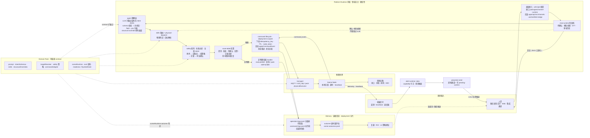
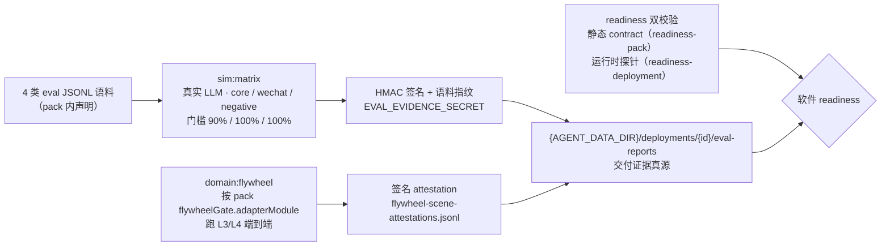

# 平台运行架构

**状态：当前顶层架构真源。**

一句话：**Platform Runtime 把受约束的 Agent 意图变成可追踪的现场动作；Domain Pack 提供具体物理领域契约；一个 deployment 只启用一个 active Domain Pack。**

## 核心概念

| 概念             | 当前定义                                                                          |
| ---------------- | --------------------------------------------------------------------------------- |
| Platform Runtime | 通道、LLM、路由、安全、Node、Memory、Deployment 的通用运行时                      |
| Domain Pack      | 物理领域契约，提供技能、schema、目标解析、安全策略、transport、outcome、readiness |
| Deployment       | 由 `deployment_id` 标识的运行实例，可对应模拟器、台架或真实现场                   |
| Scene Node       | 现场执行端契约，负责节点身份、配置应用、命令状态、本地安全与事件回报              |
| Principal        | 操作者身份，用于绑定、角色、权限和操作归因                                        |
| Memory           | 指令、操作、outcome、失败样本、策略草稿等可审计运行记忆                           |

三条轴必须分开：

```text
Principal  谁在操作
Deployment 在哪具身
DomainPack 按什么领域思考和行动
```

## 架构图（数据流视角）

第一性原理：系统的本质是把**现场信号**确定性地变成**可审计的物理动作与结果**。物理世界给出三个硬约束——**动作不可回滚**（开阀、升温、移动机器人没有 undo）、**不动作有可计价损失**（漏判一次高温可能烧一棚苗）、**现场接口高度异构且必须可接**（MQTT、Modbus、私有网关并存）。它们直接决定数据流的形状：

- 意图与动作之间必须有**确认门 + 失败关闭的 safety 裁判**（动作不可回滚）；
- 动作之后必须有**遥测回流 + outcome 延时窗评估**闭合证据（损失可计价、过程可追责）；
- 链路末端必须是**可插拔 transport**（现场接口差异由 Domain Pack 适配）。

由此全系统只有三条数据流，**Platform Runtime 内核是三条流共用的确定性执行体**：

| 数据流     | 方向        | 内容                                                                              |
| ---------- | ----------- | --------------------------------------------------------------------------------- |
| 对话控制流 | 人→机→人    | 人话 → 归一化 → 对话管线 → LLM intent → 路由 → safety → 指令 → 设备 → 口语回复    |
| 主动场景流 | 机→人→机    | 遥测/事件/调度 → pack 场景触发 → 推送与确认门 → 汇入同一条安全执行链 → outcome    |
| 交付治理流 | 离线→运行时 | eval 语料 → sim-matrix / flywheel → 签名证据 → readiness 判断软件运行实例是否可用 |

### Runtime 数据流主图



单 `active_domain`：运行时只加载一个 Domain Pack。pack 经 contract 在**命名扩展点**注入内核——prompt / intentSchemas / skills / structuralOverrides 进理解层，targetResolver / safety 策略 / commandAdapter 进路由与裁判，sceneRuntime / eval / readiness 进场景、治理与 outcome 判定；内核阶段固定、领域无关，不允许被 pack 重排。

图中三处分支是理解本架构的关键，不可省略：

- **确认与槽位续接短路**（`CP -.-> RT`）：用户回「确认」或补齐槽位时**不重新过 LLM**，`stagePendingConfirm` / `stagePendingClarification` 以 `kind: "route"` 直接进路由（`packages/chat-runtime/src/pipeline.ts`）。二次确认因此是确定性路径，不受模型波动影响。
- **safety 全量、command lifecycle 非全量**：`evaluateCommand` 对**所有** intent 执行（非物理时 `device` 为 undefined），评估结果由 route-table 前置段转成拒绝或待确认回复；告警阈值与汇报配置变更也在 route-table 内完成。只有物理技能进 command lifecycle 与 transport，其余查询类经 `dispatchNonPhysicalSkill` → `executeSkill` 回复（`apps/api/src/skills/router.ts`）。
- **主动推送不经对话管线**：jobs 经 `proactive-send` 直推通道并写 `pending-confirm`（`apps/api/src/alerts/sustained-push.ts`）；用户确认后才从通道回到内核，汇入同一条安全执行链。

设备侧回流同样分两路：`command_event` 先回 command lifecycle 由 `applyCommandEvent` 推进状态机并分发终态（`apps/api/src/mqtt/handle-event-message.ts`），再落 Memory；telemetry / heartbeat 回到机器信号侧驱动告警扫描，构成主动场景流的闭环。

三条轴在图上的落点：**Principal** 在通道接入（绑定）与 safety 首步（角色）；**Deployment** 在 command lifecycle 的 topic 前缀与 Memory 的 `deployments/{deployment_id}` 分片；**DomainPack** 即虚线扩展点。

### 交付治理流



证据分层：sim-matrix evidence 只覆盖意图层离线评测；执行层 per-command 证据由 `command_id` 串联 command → outcome → memory（见 §运维门禁）。

readiness 只回答 contract、配置、transport 探针与评测证据是否满足软件运行要求，不等同于真实执行器、现场互锁或安全认证。物理验收必须按 deployment 单独记录硬件、固件配置、动作前后遥测与人工结果。

## 平台职责

| 能力               | 平台职责                                                    | 当前位置                                                           |
| ------------------ | ----------------------------------------------------------- | ------------------------------------------------------------------ |
| Channel Runtime    | 标准化 Web、微信、集成消息，处理绑定和回复                  | `packages/channel-runtime`、`apps/api/src/channels/`               |
| Chat Runtime       | 对话 pipeline：pending-confirm、路由、回复编排              | `packages/chat-runtime`、`apps/api/src/chat/`                      |
| Agent Runtime      | LLM-only 意图解析、schema 校验、澄清、确认、NLG             | `packages/agent`                                                   |
| Skill Runtime      | 合并平台技能与 active Domain Pack，执行确定性路由           | `packages/core`、`packages/runtime`、`apps/api/src/skills/`        |
| Alert Runtime      | 阈值 breach、sustained anomaly 扫描                         | `packages/alert-runtime`、`apps/api/src/alerts/`                   |
| Platform Host      | contract-first active pack facade、ops control              | `apps/api/src/domain-packs/`                                       |
| Safety             | 权限、时长、二次确认、离线与手动优先拒绝                    | `packages/safety`、`apps/api/src/policy/`                          |
| Node Runtime       | 注册、配对、token、config、MQTT、heartbeat                  | `packages/node`、`firmware/scene-node/`                            |
| Memory             | command store、operation log、outcome、intent failure、ROI  | `packages/memory`、`apps/api/src/commands/`、`apps/api/src/scene/` |
| Deployment Runtime | `AGENT_DATA_DIR`、`deployments/{deployment_id}`、topic 前缀 | `packages/platform`、`apps/api/src/fs/deployment-path.ts`          |

平台原则：

- LLM 只输出结构化 intent，不直接控制硬件。
- 物理动作必须经过确定性路由、安全裁判、command lifecycle 和审计日志。
- 缺少关键配置时失败可见，不做隐式兜底。
- 平台包不新增行业对象硬编码；行业语义放入 Domain Pack。
- 公开 catalog 入口为 `GET /domain-packs`（`apps/api/src/app.ts`），供未鉴权 Web catalog 消费非敏感运行态目录。

### 北向适配与可选治理层

- **MCP** 若接入，应是北向 adapter：把 Runtime 已有的查询与受控动作暴露给外部 Agent / tool host。MCP 调用不得绕过 principal 绑定、schema、安全裁判、command lifecycle、遥测与 outcome。
- **SINT 类能力**属于可选治理层，可在 Runtime 外围增加 capability token、组织级审批或防篡改审计；它不替代确定性执行内核，也不属于 Domain Pack。
- **MQTT、Modbus、HTTP、未来 ROS 2**属于南向 transport / executor adapter，负责接现场系统，不承担 Agent 授权决策。
- 当前仓库未实现 MCP、ROS 2 或 SINT 协议适配；文档中的位置定义不是能力承诺。

## Domain Pack 职责

Domain Pack 作者与运行 contract：

```text
DomainPackCore
  manifest, skills, intentSchemas, prompt, eval
  structuralOverrides, targetResolver, safety
  commandAdapter?, readiness?, sceneRuntime, context
capabilities[]
  scene, ops, evidence（必需）
  skill-handler, nlg, clarification, pre-dispatch, conversation, …（按需）
```

所有可加载 pack 通过 `createDomainPackContract()` 导出；loader 只接受 contract。monolithic `DomainPack` 作者类型已删除（由 `createDomainPackContract()` 取代），不再作为新 pack 入口。

当前 active pack 由 `ACTIVE_DOMAIN` 或 `settings.json.active_domain` 显式决定。生产环境必须为单值。

`structuralOverrides` 是理解层例外通道，只在 LLM 返回 clarification 或 schema repair 仍失败后尝试固定结构修复；已通过 schema 的 LLM intent 不允许被 structural override 覆盖。

ops schema 可选携带 `devices.binding.deviceTemplate`；Web 侧在 `useOpsSchema()` 读到后，通过 `registerDeviceTemplateForPack` 注入运行时设备模板映射（见 `apps/web/src/nodeBinding.ts`）。

当前包与证据成熟度：

- `agriculture`：`scenes/greenhouse`，Runtime 可加载；农场工长双棚模拟链已验证，真棚执行器闭环待验收。
- `robotics`：`scenes/robot`，Runtime 可加载；M20 stub 已验证，真实 M20 验收证据未入库。
- `industrial`：`scenes/industrial`，Runtime 可加载；内存 Modbus / 模拟排风已验证，真柜 TCP 与执行器待验收。
- `aquaculture`：`scenes/aquaculture`，placeholder，无执行端验证。

catalog 的 `status: live` 是运行时枚举，表示 pack 可被启用并参加软件门禁；它不是现场交付或真实硬件验收状态。

## 运行流

拓扑与证据回流见上文「架构图（数据流视角）」；本节为两条主链路的精确时序。

### 对话控制

```text
Web / 微信 / 集成通道
  → Channel Runtime 标准化消息与用户身份
  → Agent Runtime 加载 active Domain Pack prompt 并解析 intent
  → Skill Runtime 路由 intent
  → Domain Pack targetResolver 解析设备或外部 transport
  → Safety 裁判和 pending-confirm
  → MQTT / M20 HTTP 等 transport
  → command event / telemetry
  → Memory 记录 command、operation、outcome
```

### 主动场景

```text
telemetry / command terminal event / scheduler
  → Domain Pack scene trigger
  → 平台通知与 pending-confirm
  → 用户确认后进入同一条安全执行链
  → outcome 窗口复盘
  → L4 策略建议 / ROI
```

## 数据根

默认数据根：

```text
.agentstack/dev-profiles/default/data
```

本地场景 profile 数据根：

```text
.agentstack/dev-profiles/{greenhouse|robot|industrial}/data
```

飞轮验证运行不是独立 Domain Pack 或场景 profile；`npm run domain:flywheel` 按当前 active Domain Pack 加载对应 adapter。agriculture 默认使用：

```text
.agentstack/dev-runs/domain-flywheel/agriculture/data
```

生产和测试应显式设置 `AGENT_DATA_DIR`。运行数据结构：

```text
{AGENT_DATA_DIR}/
├── settings.json
├── device-registry.json
├── users.json
├── platform-bindings.json
└── deployments/{deployment_id}/...
```

不再恢复源码包内旧默认数据目录；需要历史运行数据时，从本机 `.agentstack/archive/runtime-data/` 手动恢复到显式 `AGENT_DATA_DIR`。

## Transport

| Transport  | 当前场景   | 说明                                                                                           |
| ---------- | ---------- | ---------------------------------------------------------------------------------------------- |
| `mqtt`     | greenhouse | API 发布到 `deployments/{deployment_id}/nodes/{node_id}/commands`，Scene Node 上报事件推进状态 |
| `m20_http` | robot      | API 创建 command record 后调用 M20 HTTP API，再写完成/失败事件                                 |

节点事件、遥测和 heartbeat 必须携带 `node_token`。topic 中的 `deployment_id` / `node_id` 必须与 payload 一致。

## 运维门禁

### Readiness 与 settings 保存

- **真源：** `packages/runtime/src/readiness.ts`（`evaluateDomainPackReadinessFromContract`、`evaluateDomainPackRuntimeReadiness`、`collectDomainPackConfigRegistryIssues`、`collectDomainPackTransportIssues`）。`apps/api/src/domain-packs/readiness.ts` shim 已删除；脚本与测试直引 `@embodied-agent/runtime`。
- **Admin `PUT /admin/settings`：**
  - 切换 `active_domain` 或保存 `domain_configs` 时，仅阻断 **config + registry** 错误（`blockingConfigRegistryReadinessIssues`）。
  - 切换到 MQTT-required pack 时，校验**有效** `mqtt_url`（请求体或已持久化值）；不要求 publisher 此时已连接（避免冷启动死锁）。
  - `mqtt_url` 在 `body.mqtt_url !== undefined` 时写入 patch（含空字符串，供非 MQTT pack 清空）；MQTT-required pack 禁止保存空值。
  - `mqtt_url` 变更后调用 `restartMqttSubscribers()` 重连 telemetry/event 订阅，无需重启 API 进程。
- **Transport：** `collectDomainPackTransportIssues` 用于 runtime readiness 探针与 ops 展示；**不**作为 settings 保存的硬阻断（第六～七轮 review 收口）。
- Live pack readiness 必须声明 `probe()` 或 `probeNotRequired.reason`（DomainPackRuntimeReadiness 类型见 `packages/core/src/scene-contract.ts:188`；同构门禁见 `scripts/check-domain-pack-contracts.ts`）。greenhouse/industrial 用 `probeNotRequired`，robot 保留真实 HTTP probe。
- **证据分层：** sim-matrix evidence 只覆盖意图层离线评测（row_hash 基于 eval corpus 行，不关联 command_id）；执行层 per-command 证据则由 `command_id` 串联 command→outcome→memory，并由 `scene-outcomes.jsonl` + `command-logs.jsonl` 承担。

### 后台任务与 capability 守卫

`apps/api/src/jobs/start.ts` 启动 digest、weather、NDVI、MQTT 订阅与 60s 告警/汇报轮询。各调度器按 active pack capability 早退，避免切域后无 capability 仍抛错：

| 调度         | 守卫                          | 位置                                                     |
| ------------ | ----------------------------- | -------------------------------------------------------- |
| 早晚简报     | `hasActiveDigest()`           | `apps/api/src/digest/scheduler.ts`                       |
| 定时状态汇报 | `hasActiveScheduledReports()` | `apps/api/src/report/scheduler.ts`                       |
| 天气主动推送 | `hasActiveWeatherProactive()` | `apps/api/src/weather/scheduler.ts`                      |
| 持续性告警   | `hasActiveProactiveAlerts()`  | `apps/api/src/alerts/sustained-push.ts`、`jobs/start.ts` |
| NDVI         | pack satellite capability     | `apps/api/src/integrations/satellite/scheduler.ts`       |

`active_domain` 变更后：`syncActivePackBoundDomainServices` + `restartDomainCapabilitySchedulers()`（digest / weather / NDVI 重启）。

### 告警冷却（reserve → confirm）

阈值、离线、持续性 L1/L2 推送使用文件锁冷却（`apps/api/src/alerts/alert-state.ts`）：

1. `reserveAlertCooldown` — 占位 reservation；`FileLockBusyError` 短退避重试。
2. 微信发送成功 → `confirmAlertFiredResilient` — 写入 `last_fired` 并清除 reservation；多轮重试后仍失败则**只记 error 日志、不向调用方抛错**（避免发送成功但 confirm 抛错导致重复推送）。
3. 发送失败 → `releaseAlertReservation`。

非法 `last_fired` 时间戳视为已过期冷却。状态损坏（JSON/schema）仍 throw，与 sustained-state 一致。

### Admin 域内物理控制

- `POST /admin/domain/intents` — 解析 active pack schema 的 intent 并走路由链。
- `POST /admin/domain/control-actions` — 读 ops schema `control.actions`，编译 intent 后路由。
- `domainPackAdminRouteContext` 在路由前 `connectAdminMqtt()`（对齐 chat `pipeline-ports.connectMqtt`）；连接失败打 warn 日志，物理技能返回 503。
