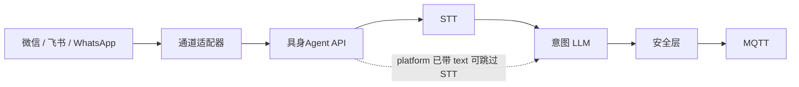

# 集成聊天与语音原则（`/integrations/chat`）

## 用户承诺（产品）

现场用户在 **微信 / 飞书 / WhatsApp** 等已用 IM 里：

- 只发 **文字** 或 **语音**；
- 不需要安装第二套 App、不需要理解 STT/模型/通道；
- 收到的是 **工长式口语回复**（查数、已执行、拒绝原因、请再说一遍）。

所有「听清 → 转文字 → 理解意图 → 安全执行 → 回复」由 **`apps/api` 聊天流水线** 闭环；小龙虾（OpenClaw）等只做 **消息搬运与鉴权**，不做业务大脑。本仓库内置 **iLink bridge** 可走同一条流水线，无需 HTTP 回调。

详见 [`docs/architecture/implementation.zh.md`](../architecture/implementation.zh.md) 聊天通道职责。

## 架构：薄通道 + 厚 API

```text
用户（IM 语音/文字）
  → 通道适配器（小龙虾 / 企微 / 飞书 Webhook …）
  → POST /integrations/chat
  → [API] STT（若有音频）→ LLM 意图 JSON → 安全层 → MQTT
  → 文本 reply → 通道适配器 → 用户 IM
```



| 层         | 职责                                               | 不应由用户配置 |
| ---------- | -------------------------------------------------- | -------------- |
| 通道适配器 | 登录/收消息/回消息、平台 `user_id`、下载语音二进制 | —              |
| API 媒体层 | STT、格式转换、失败话术「没听清请再说」            | ASR 厂商、Key  |
| API 认知层 | LLM → 结构化意图（Zod）                            | 模型名         |
| API 执行层 | 技能、MQTT、操作日志                               | —              |

## 集成契约（统一）

**URL：** `POST /integrations/chat`  
**鉴权：** `Authorization: Bearer <INTEGRATION_SECRET>`

| 字段              | 必填           | 说明                                                            |
| ----------------- | -------------- | --------------------------------------------------------------- |
| `text`            | 与音频二选一\* | 用户 utterance；平台已转写时可只传此项                          |
| `audio_base64`    | 与文本二选一\* | 语音二进制 Base64；**优先由 API STT**                           |
| `audio_format`    | 建议           | `wav` / `mp3` / `webm` / `amr` 等，默认 `wav`                   |
| `user_id`         | 是             | 平台用户 ID；必须已通过 `platform-bindings.json` 绑定到现场账号 |
| `conversation_id` | 否             | 会话 ID                                                         |
| `deployment_id`   | 否             | 多 deployment 路由校验；必须与当前运行时一致                    |
| `platform`        | 是             | 如 `wechat`、`feishu`、`whatsapp`；缺失时请求失败               |

\* 至少提供 `text` 或 `audio_base64` 之一。同时提供时：**转写结果与 `text` 拼接** 后进入意图解析（实现见 `apps/api/src/intent/stt.ts`）。

**响应：** `{ "reply": "..." }`（HTTP 与 `/dev/chat` 一致）。

### STT 优先级（API 内，对用户透明）

1. 请求已带可靠 `text`（平台转写）→ 可直接意图解析，可选跳过 STT。
2. 请求带 `audio_base64` → API STT（见下表）。
3. STT 失败 → 统一回复「没听清，请再说一遍或打字」，**不由通道 Agent 自由发挥**。

| `stt_provider`   | 当前代码           | 说明                                                 |
| ---------------- | ------------------ | ---------------------------------------------------- |
| `none`           | 仅文字             | 语音需通道侧先转写并传 `text`                        |
| `openai_whisper` | OpenAI Whisper API | 可与 OpenAI LLM 共用 Key，也可单独配置 `stt_api_key` |
| `aliyun`         | 阿里云 NLS         | 国内试点可用                                         |
| `iflytek`        | 讯飞听写           | 国内试点可用                                         |

LLM provider 与 STT provider 分离：意图模型可用 DeepSeek，同时语音转写可选阿里云、讯飞或 OpenAI。

配置细节：[`openai-voice.zh.md`](openai-voice.zh.md)。微信小龙虾：[`wechat-lobster.zh.md`](wechat-lobster.zh.md)。

## 通道适配器选型

| 通道        | 推荐接入                    | 龙虾角色               |
| ----------- | --------------------------- | ---------------------- |
| 微信个人号  | 腾讯 `openclaw-weixin` 等桥 | **常用**：仅 IM 适配器 |
| 飞书 / Lark | 官方 Bot Webhook            | **可选**：可直连 API   |
| WhatsApp    | 官方 Cloud API 或 OpenClaw  | **可选**               |
| 企业微信    | 官方应用 Webhook            | **可选**               |

原则：**同一契约** `POST /integrations/chat`，不因通道改变业务流水线。

## 竞品与方案对照（调研摘要）

| 类型               | 代表                           | 用户怎么用              | 语音/STT                      | 自然语言控棚               | 与具身Agent 差异             |
| ------------------ | ------------------------------ | ----------------------- | ----------------------------- | -------------------------- | ---------------------------- |
| 厂商 App / 大屏    | 温室环控一体机、智易时代类方案 | 专用 App 点按钮、看曲线 | 少见                          | 弱                         | 换系统，非叠加               |
| IoT 云平台         | 涂鸦智慧农业、有人云等         | App/小程序面板          | 家居语音技能为主              | 弱                         | 连接强，农业语义与安全层弱   |
| 小程序 + 云 ASR    | 阿里云/讯飞小程序 SDK          | 按住说话                | 客户端+云 ASR，控制在自建 API | 可定制                     | 多一个入口，非「只在微信聊」 |
| IM + 通用 Agent    | OpenClaw / 小龙虾              | 微信里像聊天            | 通道内 STT                    | Agent 泛聊，易跑偏         | 缺固定技能+互锁+留痕         |
| **API 中心化工长** | **具身Agent（目标）**          | **IM 发语音/字**        | **API STT**                   | **LLM 意图 → 技能 → MQTT** | **叠加现场设备 + 安全层**    |

差异化一句话：**农民已在用的 IM 里说一句人话，具身Agent API 负责听懂并安全执行，而不是再装一套平台或第二个 AI。**

## 对用户隐藏、对部署可见

| 项                 | 配置位置                                     |
| ------------------ | -------------------------------------------- |
| LLM / STT Key      | Web 配置台、`{AGENT_DATA_DIR}/settings.json` |
| 集成密钥           | 与通道适配器 Bearer 一致                     |
| MQTT / entity 别名 | 配置台或环境变量                             |
| 微信扫码 / 配对    | 安装人员一次性完成                           |

## 失败话术（须由 API 生成）

| 场景       | 回复方向                           |
| ---------- | ---------------------------------- |
| STT 失败   | 没听清，请重说或打字               |
| 意图不清   | 澄清问句（哪座棚、开还是关）       |
| 安全拒绝   | 说明原因（手动优先、超时、无权限） |
| LLM 不可用 | 工长暂不可用，请稍后再试           |

通道适配器 **只转发** `reply`，避免 OpenClaw Agent 插入无关对话。

## iLink bridge 入站行为（内置）

`apps/api/src/wechat/ilink-bridge.ts` 轮询 iLink 消息，与 `/integrations/chat` 共用 `processChatMessage` 流水线。

| 行为     | 说明                                                                               |
| -------- | ---------------------------------------------------------------------------------- |
| 语音分片 | `message_state !== 2` 且无转写时跳过本轮，等待最终包                               |
| 入站去重 | `context_token` 在 **回复发送成功后** 才标记（`inbound-dedup.ts`），发送失败可重试 |
| 去重 TTL | 24h，按 `account_id:from_user_id:context_token`                                    |

## 部署选型

| 形态              | 适用                                                                                                                                           |
| ----------------- | ---------------------------------------------------------------------------------------------------------------------------------------------- |
| **Compose / VPS** | 试点与生产：持久化 `agent_data`、MQTT 订阅、微信 iLink bridge、告警/简报 scheduler                                                             |
| **Vercel**        | 仅静态 Web + 无状态 `POST /integrations/chat`；**无**持久化、后台任务与主动推送；试点/生产请用 VPS systemd（[`deploy/vps/README.zh.md`](../../deploy/vps/README.zh.md)） |

## 实施路线

| 阶段        | 用户可见                 | 工程                                                                                             |
| ----------- | ------------------------ | ------------------------------------------------------------------------------------------------ |
| 现在        | 文字控棚；语音经 API STT | `audio_base64` + OpenAI Whisper / 阿里云 / 讯飞（见 [`openai-voice.zh.md`](openai-voice.zh.md)） |
| **P0 试点** | 微信发语音即可           | 外部通道适配器 **优先传 `audio_base64`**；API STT 已支持多提供商，配置台选择                     |
| **P1**      | 飞书/WhatsApp 同一体验   | 官方 Bot 直连 API，OpenClaw 可选                                                                 |
| **P2**      | 可选小程序只看曲线/绑定  | 聊天仍在 IM；小程序不承担 STT                                                                    |
| 非 MVP      | 电话级实时对话           | OpenAI Realtime 等，控棚短指令通常不需要                                                         |

## 相关文档

- [`wechat-lobster.zh.md`](wechat-lobster.zh.md) — 微信 + 小龙虾适配器
- [`user-binding.zh.md`](user-binding.zh.md) — IM 用户配对绑定
- [`openclaw-forwarder.example.json5`](openclaw-forwarder.example.json5) — 小龙虾转发示例
- [`openai-voice.zh.md`](openai-voice.zh.md) — OpenAI Whisper + GPT
- [`deploy/vps/README.zh.md`](../../deploy/vps/README.zh.md) — VPS 本机 systemd 一体机部署（试点与生产推荐）
- [`docs/archive/research-report.zh.md`](../archive/research-report.zh.md) — 聊天平台与 MVP 范围
